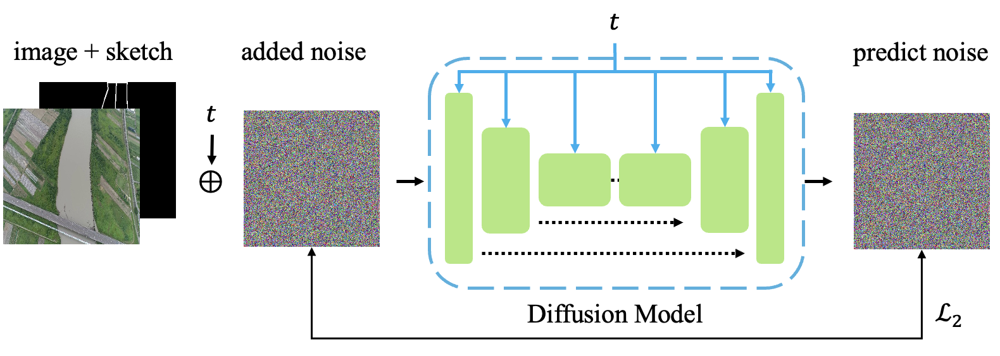

# README



## 🔧 A. Installation

### Step 1: Create environment

* Ubuntu 22.04 with Python ≥ 3.10 (we used GPU under 11.8 CUDA version)

```shell
conda create --name sketch python=3.10 -y
conda activate sketch
```

### Step 2: Install the dependencies

```shell
conda install pytorch==2.0.1 torchvision==0.15.2 torchaudio==2.0.2 pytorch-cuda=11.8 -c pytorch -c nvidia
conda install xformers -c xformers -y
pip install -r requirements.txt
```

### Step 3: Prepare dataset

Users should prepare the data into a diretory called `{WHAHTEVER_YOU_LIKE}`. It will be in the following structures

```shell
📦 {WHAHTEVER_YOU_LIKE}
┣ 📂 img/*.jpg         # Image data for training
┣ 📂 label_img/*.png   # Label data for training
┗ 📂 test_label/*.png  # Label data for testing
```

> We recommend `{WHAHTEVER_YOU_LIKE}` to be `data` to follow the following example.

Afterwards, exectute the following command to create the csv file for training

```shell
python misc/make_csv.py --root {WHAHTEVER_YOU_LIKE} --output {WHAHTEVER_YOU_LIKE}/train.csv
```

Finally, you will find the following directory structure:

```shell
📦 {WHAHTEVER_YOU_LIKE}
┣ (other stuffs mentioned before)
┗ 📜 train.csv         # csv file for training
```

### Step 4: Modify the training path

Please modify the path to where you would like to save the checkpoints and logs in the `configs/default.yaml` file.

```yaml
PROJECT_DIR: {CHANGE_HERE} # Change this to save the checkpoints and log
TRAIN:
  CSV: {CHANGE_HERE}       # Change this to the csv file for training
```

### (Optional) Downloading the pre-trained model

```shell
gdown 1NAgUo7PsLK-jTZPx4Evbqof4mGFsk5fF
```

## 🛠️  B. Usage

> Users can use the pre-trained weight we provided to run with the following commands.

### B.1 Training a model

```shell
# with single-gpu
python main.py --config configs/default.yaml

# with multi-gpus
accelerate launch --multi_gpu --num_processes={NUM_OF_GPU} main.py --config configs/default.yaml
```

### B.2 Generating from pure noise

```shell
python misc/generate_cond.py --cond-root {PATH/TO/TEST/LABEL} --save-folder {PLACE/FOR/OUTPUT} --config configs/default.yaml \
    --batch-size {NUM_BATCH_SIZE} --num-process {NUM_PROCESS} --opts EVAL.CHECKPOINT {PATH/TO/CHECKPOINT}

# Concrete example
python misc/generate_cond.py --cond-root data/test_label --save-folder generate_out --config configs/default.yaml \
    --batch-size 8 --num-process 4 --opts EVAL.CHECKPOINT best.pth
```

### B.3 Generating with RAG

```shell
python misc/generate_with_search.py --use-ssim --cond-root {PATH/TO/TEST/LABEL} --save-folder {PLACE/FOR/OUTPUT} --config configs/default.yaml \
    --batch-size {NUM_BATCH_SIZE} --num-process {NUM_PROCESS} --opts EVAL.CHECKPOINT {PATH/TO/CHECKPOINT}

# Concrete example
python misc/generate_with_search.py --use-ssim --cond-root data/test_label/ --save-folder generate_out --config configs/default.yaml \
    --batch-size 8 --num-process 4 --opts EVAL.CHECKPOINT best.pth
```

### B.4 Generating with random RAG

```shell
python misc/generate_with_search.py --add-noise-step {STEP/FOR/BACKWARD} --cond-root {PATH/TO/TEST/LABEL} --save-folder {PLACE/FOR/OUTPUT} --config configs/default.yaml \
    --batch-size {NUM_BATCH_SIZE} --num-process {NUM_PROCESS} --opts EVAL.CHECKPOINT {PATH/TO/CHECKPOINT}

# Concrete example
python misc/generate_with_search.py --add-noise-step 300 --cond-root data/test_label/ --save-folder generate_out --config configs/default.yaml \
    --batch-size 8 --num-process 4 --opts EVAL.CHECKPOINT best.pth
```

## Project Template

Please check [deep-learning-template](https://github.com/Justin900429/deep-learning-template) for more information.
